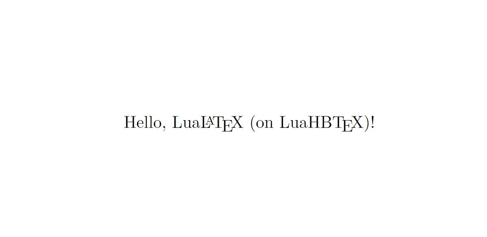

# LaTeX 忘備録

LaTeX を使っていてエラーなどでつまずいたものの中で解決できたものをここに忘備録として記す.

## 目次

- [環境](#環境)
- [Error01 (2023/11/02)](#error01)
- [Error02 (2023/11/12)](#error02)
- [Error03 (2023/11/16)](#error03)

## 環境

実行環境及びLaTeXのバージョンは以下の通り.

`cmd` で `code --v` とすることで VScode のバージョンを確認.

```cmd
1.84.2
1a5daa3a0231a0fbba4f14db7ec463cf99d7768e
x64
```

TeX Live のバージョンを `tex --v` で確認.

```cmd
TeX 3.141592653 (TeX Live 2022)
kpathsea version 6.3.4
```

使用しているLaTeXを [`hello.tex`](https://gist.github.com/zr-tex8r/27bc6ddf376d4f716e7276c7dad5ec75) で確認. [`hello.tex`](https://gist.github.com/zr-tex8r/27bc6ddf376d4f716e7276c7dad5ec75) をビルドし, 生成された `hello.pdf` に使用している LaTeX が表示される.

> <a href="https://qiita.com/zr_tex8r/items/a924be192ecea7e6bbe4" target="_blank">自分がどのLaTeXを使ってるか知りたい話</a>

##### hello.pdf

> 

LuaLaTeX のバージョンを `lualatex --v` で確認.

```cmd
This is LuaHBTeX, Version 1.15.0 (TeX Live 2022)
```

### 総括

> VScode 1.84.2 (x64)
> TeX Live 2022
> LuaLaTeX on LuaHBTeX Version 1.15.0

`lualatex` には, LaTeX エンジンの LuaLaTeX と TeX エンジンの LuaHBTeX がある. TeX Live 2022 には, LuaHBTeX 1.15.0, LuaTeX 1.15.0 が収録されている. LuaHBTeX は, LuaLaTeX を日本語組版に特化させたもので, テキストレイアウトエンジンである HarfBuzz ライブラリを使用している.

## Error01

### Q. Adobe Acrobat で .pdf を開くと, 「このページにはエラーがあります。Acrobatはページを正しく表示できない場合があります。PDF文書の作成者に連絡して、問題を解決してください。」というエラーが発生

### A. LuaLaTex では DVI 形式を経由せずに PDF を出力するため, DVI ドライバの設定は削除しなければならない

#### 使用例

```latex
\documentclass{ltjsarticle}
\usepackage{graphicx}
\usepackage{color} 
```

>従来の LaTeX では, `\usepackage[dvipdfmx]{graphicx}` のように DVI ドライバを指定していたが, LuaLaTeXは適切なドライバを自動で選択してくれるため, ユーザが指定する必要はない.
><a href="https://www.metaphysica.info/uplatex-to-lualatex/" target="_blank">p/upLaTeX から LuaLaTeX へ移行すべき理由と方法</a>

## Error02

### Q. itembox でページをまたぎたい

### A. tcolorbox を利用. ページまたぎをするためにはオプションにbreakableを追加する

>itembkbxパッケージのbreakitemboxを利用する方法もあるが上手くいかなかった...
なお, itembkbxはCTANにないため, GitHubから入手する必要がある.
><a href="https://muscle-keisuke.hatenablog.com/entry/2016/02/11/195004" target="_blank">LaTeXで載せたプログラムソースがページを跨ぐ場合の対処法について</a>

#### 使用例

tcolorboxパッケージはCTANに含まれている (TeX Live2022 には初めから入っている) ためプリアンブルに以下のように記述すればよい.

```latex
\usepackage{tcolorbox}
\tcbuselibrary{breakable}
```

ドキュメントには以下のように記述する.

```latex
\begin{tcolorbox}[title=Mytitle, breakable]
% <-- ここに内容 -->
\end{tcolorbox}
```

tcolorboxのオプションに `breakable` を指定するためには, プリアンブルに `\tcbuselibrary{breakable}` を加える必要がある.

><a href="https://texmedicine.hatenadiary.jp/entry/2015/12/17/000339" target="_blank">tcolorboxの基本</a>
><a href="https://ctan.math.washington.edu/tex-archive/macros/latex/contrib/tcolorbox/tcolorbox.pdf" target="_blank">tcolorbox Manual for version 6.1.0 (2023/09/26)</a>

## Error03

### Q. Overfull \hbox となる longtable を resize したい

### A. small コマンドなどを利用して longtable 内のフォントサイズを小さくする

> `tabular` を縮小する際には `\resizebox` が使えるが, `longtable` に対しては使えない.

#### 使用例

`longtable` を使うためには, プリアンブルに以下のように記述する必要がある.

```latex
\usepackage{longtable}
```

ドキュメントには以下のように記述する.

```latex
\begingroup
\small
\begin{longtable}{ccc}
    % firsthead : 表の１ページ目の最初に表示.
    \caption{resizelt \label{tb:relt}} \\
    \hline element1 & element2 & element3 \\ \hline
    \endfirsthead

    % head : 表の各ページの最初に表示. 
    \hline element1 & element2 & element3 \\ \hline
    \endhead

    % foot : 表の各ページの最後に表示. 
    \hline \multicolumn{3}{r}{next pages} \\ \hline
    \endfoot

    % lastfoot : 表の最終ページの最後に表示. 
    \hline \multicolumn{3}{r}{end} \\ \hline
    \endlastfoot

    % <-- ここから表の内容  -->
    demo    &   demo    &   demo    \\  \hline

\end{longtable}
\endgroup
```

`{\small\begin{longtable} \end{longtable}}` でも可能.
